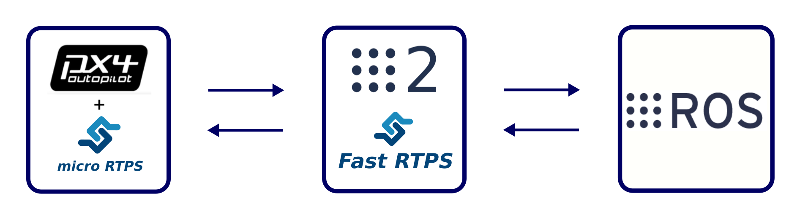
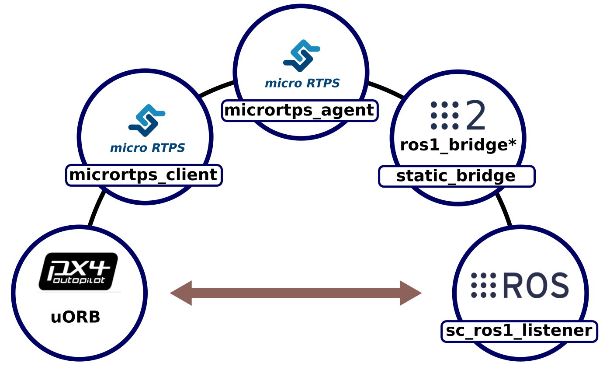

PX4-FastRTPS-ROS
================

This proof of concept aims to extend the `bridge PX4-FastRTPS <https://github.com/eProsima/Firmware.git>`_ to **ROS** and test how the exchange of information works between nodes of PX4 and ROS. The PoC has been implemented and tested in a **PIXracer** for the PX4 side and a couple of **PC running Ubuntu 16.04** for micro RTPS agent, ROS2-ROS bridge and the ROS node.

The PoC has been performed over a single message **sensor combined** for the sake of simplicity.

Scheme
------

The scheme has 5 nodes involved as shown in the image above:

- **uORB**: This node is the representation of the publisher(s) that send, in this case, sensor combined messages through uORB protocol.
- **micrortps_client** is the node that get the information from uORB world, translate it and transmit to the next node in a serialization format understandable for the micro RTPS side of wich is part.
- **micrortps_agent** as a full member of the DDS world inject the received information publishing the message in the **sensor_combined_topic**.
- **static_bridge** is the node of ROS2 (part of the ros1_bridge package) that listen directly whitout previous translation the topic (taking advantage of use of the same RTPS protocol internally) and pass it from ROS 2 to ROS 1.
- **sc_ros1_listener** a very simple ROS node that listen to the well formed ROS topic, print the info on the screen and publish back into a new topic **sensor_combined_topic_back**.

**NOTE**: The same path is followed in reverse from ROS to PX4 for latency estimation.

Requierements
-------------

- **PX4-Fast RTPS brigde**: its necessary work with the `eProsima PX4/Firmware fork <https://github.com/eProsima/Firmware.git>`_, please see the `README <https://github.com/eProsima/Firmware/blob/micrortps/README_eprosima.rst>`_
- **ROS2**: Install `ROS2 <https://github.com/ros2/ros2/wiki/Linux-Development-Setup>`_ with the latest update of its packages from the master branch of `this repository <https://github.com/ros2/ros2>`_.
- **ROS from sources**: Install `ROS <http://wiki.ros.org/Installation/Source>`_ from sources (we use **kinetic** distro).

PX4 side: micro RTPS client
---------------------------

The code of the application that will run in to PX4 side will be found in **microRTPS_client** folder. To use this code replaces the original one from the client, please see the **PX4 Firmware** section in the `README <https://github.com/eProsima/Firmware/blob/micrortps/README_eprosima.rst>`_ in case of doubt.

Fast RTPS side: micro RTPS agent
--------------------------------

The code of the application that will run as micro RTPS agent will be found in **microRTPS_agent** folder. To use this code replaces the original one from the agent, please see the **Fast RTPS (Raspberry PI application)** section in the `README <https://github.com/eProsima/Firmware/blob/micrortps/README_eprosima.rst>`_ in case of doubt.

ROS side
--------

We need to add two packages to our ROS workspace. For that copy them:

.. code-block:: bash

    $ cd /path/to/px4_to_ros
    $ cp -r px4_msgs_ros1 /path/to/ros1/workspace/src/px4_msgs
    $ cp -r sensor_combined_ros1 /path/to/ros1/workspace/src/

Compile the packages using:

.. code-block:: bash

    $ catkin_make_isolated --pkg px4_msgs --install -DCMAKE_BUILD_TYPE=Release
    $ catkin_make_isolated --pkg sensor_combined_ros1 --install -DCMAKE_BUILD_TYPE=Release

For launch the application we need to launch in first place **roscore** in a separate shell:

.. code-block:: bash

    $ source /path/to/ros1/workspace/install_folder/setup.bash
    $ roscore

Now, you can run the listener application with:

.. code-block:: bash

    $ source /path/to/ros1/workspace/install_folder/setup.bash
    $ rosrun sensor_combined_ros1 sc_ros1_listener

ROS2 side
---------

In order to run the ROS2 to ROS1 bridge, you have to add one package and modify other (**ros1_bridge** package) in your ROS2 worskpace. The package **px4_msgs** generates all the PX4 messages that are actually supported. To use, copy in this way:

.. code-block:: bash

    $ cd /path/to/px4_to_ros
    $ cp -r px4_msgs_ros2 /path/to/ros2/workspace/src/ros2/px4_msgs
    $ cp -r ros1_bridge /path/to/ros2/workspace/src/ros2/

Compile the package px4_msgs with ament using:

.. code-block:: bash

    $ ament build --symlink-install --only px4_msgs

compile the bridge, please see `Building the bridge from source <https://github.com/ros2/ros1_bridge/blob/master/README.md#build-the-bridge-from-source>`_

Now, you can run the bridge application with:

.. code-block:: bash

    $ source /path/to/ros1/workspace/install_folder/setup.bash
    $ source /path/to/ros2/workspace/install_folder/setup.bash
    $ static_bridge

Roscore: working in several machines
------------------------------------

In due we only need one instance of *roscore* runnig we need to make some adjustenments to work in separate machines:

Machine that runs *roscore* need to define:

.. code-block:: bash

    $ export ROS_MASTER_URI=http://localhost:11311
    $ export ROS_HOSTNAME=<LOCAL_IP>

Machine that **NOT** run *roscore* need to define:

.. code-block:: bash

    $ export ROS_MASTER_URI=http://<ROSCORE_MACHINE_IP>:11311
    $ export ROS_HOSTNAME=<LOCAL_IP>
